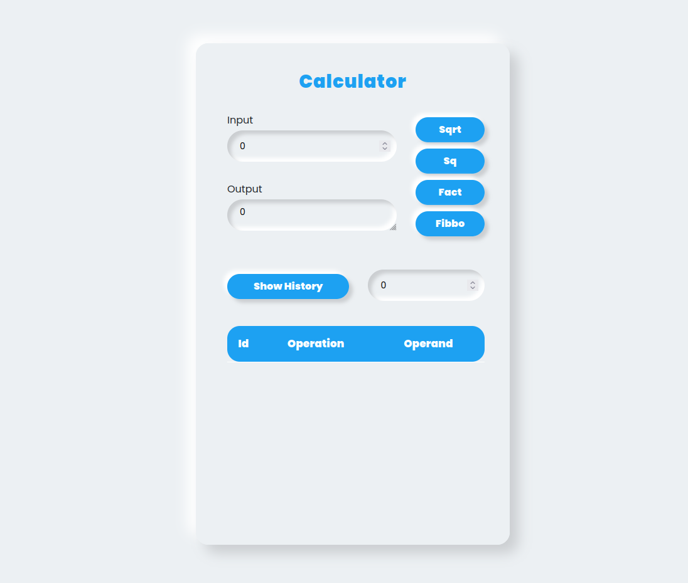
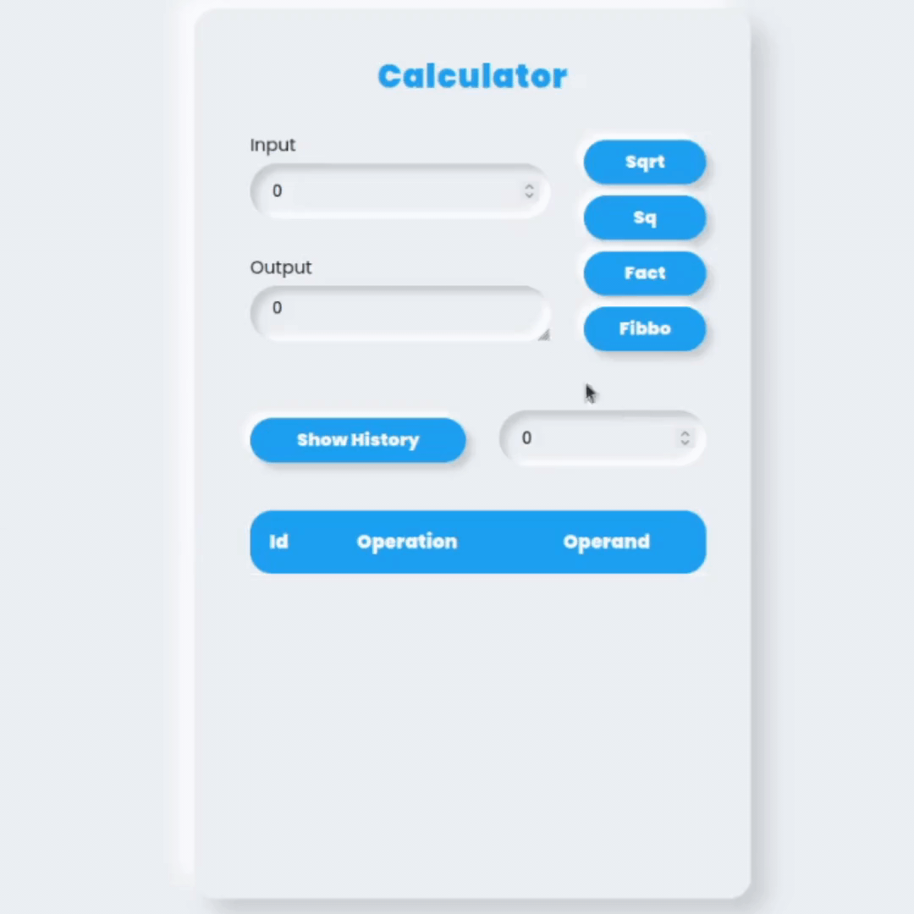

# Calculator application made with Angular and .NET core

This application has 4 funtions. Square root, Square, Factorial, and Fibonacci. Given an integer value in the input field, it calculates the result for the corresponding function. 

Also there is a "Show History" button which displays the history of the operations performed. Given the number of the last n history logs in the input field, it will display the id, operation, and the operand in a tabular manner. 

# Demo : 

# Technologies : 

1. Angular
2. .NET Core Web Api 
3. Sqlite 

# Installation instructions : 

1. Need to have .NET Core Installed 
2. Node, NPM, Angular 
3. Sqlite

# How to set up : 

Change the "ConnectionString" field's value in the 'backend/appsettings.json' file to your absolute directory location of the database which is 'calculationDB', so that it can locate the calculationDB in the backend directory. 

I kept the project in /home/shahir/Projects/Web-Projects/asp_projects/ so the "DefaultConnection" value is set to "Data Source=/home/shahir/Projects/Web-Projects/asp_projects/calculator/backend/calculationDB.db;"

If you keep the project in /home then the string will be "Data Source=/home/calculator/backend/calculationDB.db;"

# How to run : 

1. Open one terminal and cd to ./calculator/backend directory 
2. run 'dotnet run' to start the backend web api application
3. Open another terminal and cd to ./calculator/frontend/frontend
4. run 'ng serve -o'

